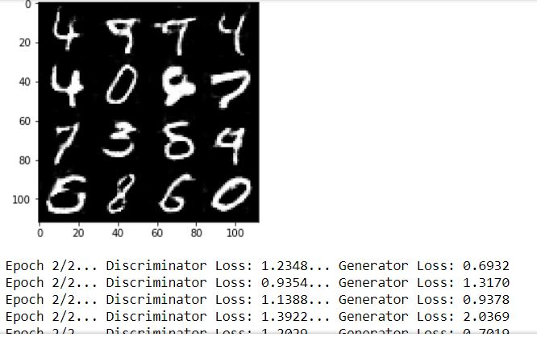
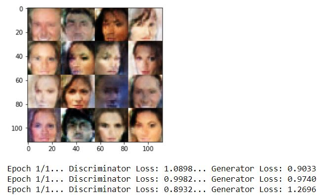

# Project 5: Face Generation

## Introduction

In this project, you'll use generative adversarial networks (GAN)to generate new images of faces.

## To do

- model_inputs
- discriminator
- generator
- model_loss
- model_opt
- show_generator_output
- train

- RUN: MNIST  dataset
- RUN: CelebA dataset

## Results

### v0 

### v1 

### v2 
Final adjustments - Feedback_v1
...

## Feedback

### v0_Feedback 
16.10.2017
* **Discriminator** 
Good work using Batch Normalization and Leaky ReLUs which allow a small non zero gradient when the unit is not active. 
Try using different values of **alpha** between 0.08 and 0.15 and compare your results. 
As you are using Batch Normalization, there is **no need to use dropouts**. However if you wish to use dropouts you should do proper testing keeping different values of kp between 0.6 and 0.9.

* **loss** 
Good work using smoothing as it prevents discriminator from being too strong and to generalize in a better way.

* **Training** 
Good work keeping sample_z between -1 and 1. 
Good work increasing batch size by a factor of 2 inside the inner for loop.

* **Parameters** 
Try using **Batch size** as 32 or 64. 
Try using different values of **learning rate** between 0.0002 and 0.0008 and different values of Beta1 between 0.2 and 0.5 and compare your results.

### v1_Feedback 
17.10.2017
* **Model input**  
It's not necessary to pass a shape parameter when defining a scalar placeholder (learning rate, for instance). Hence, passing None for the shape argument is redundant.

* **Discriminator** 
Well done on using batch normalization and a **leaky ReLU (rather than a vanilla ReLU)**. This is important since it helps the gradient flow through the network, which in turn is crucial for the network's ability to learn. 
BTW, note that since we repeatedly use a leaky ReLU activation function, it would make sense to factor it out into a separate function.

* **loss** 
I would recommend you to multiply labels (for d_loss_real) by a **smoothing factor (0.9, for instance)**. This helps optimizing this loss for the following reason: initially the generator network does not produce anything close to the real input images; hence, the discriminator quickly learns to distinguish between real inputs and generated inputs - outputting a probability close to 1; hence cross-entropy loss will involve the following computation: log(some_very_small_number), which can be unstable.

* **Training** 
You should pass the **learning rate placeholder** (created by model_inputs function; lr, in your case) to model_opt rather than the float. It is not a mistake per se. However, it reduces model's flexibility. Suppose, you want to tweak the value of the learning rate after N iterations. If you use a placeholder, you can easily pass an appropriate value of the learning rate to the feed_dict parameter of sess.run to achieve that. 
Note that you then pass lr:learning_rate to the feed_dict, which is redundant since you didn't use a placeholder to create a model, but rather a float learning_rate.

* **Parameters** 
It's a great set of hyperparameters! I hope that you played with different values to see how it affects training. 
Well done! Your model does a remarkable job generating realistic faces.

# Material used for learning & creation of the project:

udacity deep learning foundation nanodegree Unit 5 GAN -
The requirements were very similar to the exercises in this Unit and it was a very good guide for the complition of the project! Thank you udacity =)