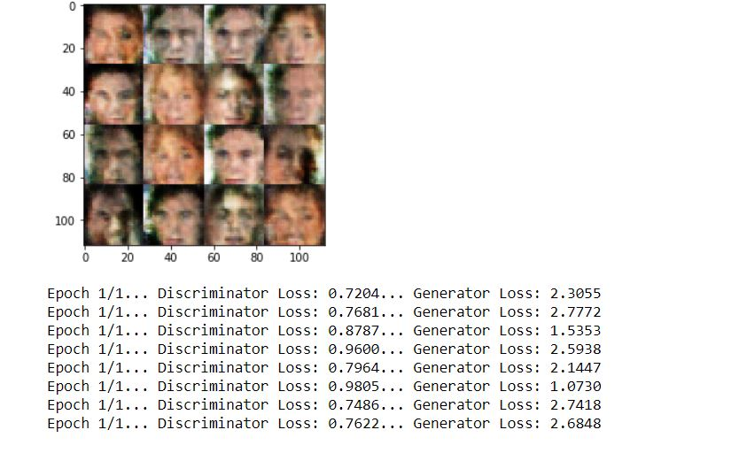

# Project 5: Face Generation

## Introduction

In this project, you'll use generative adversarial networks (GAN)to generate new images of faces.

## To do

- model_inputs
- discriminator
- generator
- model_loss
- model_opt
- show_generator_output
- train

- RUN: MNIST  dataset
- RUN: CelebA dataset

## Results

### v0 

### v1 

## Feedback

### v0_Feedback 
16.10.2017
* **Discriminator** 
Good work using Batch Normalization and Leaky ReLUs which allow a small non zero gradient when the unit is not active. 
Try using different values of **alpha** between 0.08 and 0.15 and compare your results. 
As you are using Batch Normalization, there is **no need to use dropouts**. However if you wish to use dropouts you should do proper testing keeping different values of kp between 0.6 and 0.9.

* **loss** 
Good work using smoothing as it prevents discriminator from being too strong and to generalize in a better way.

* **Training** 
Good work keeping sample_z between -1 and 1. 
Good work increasing batch size by a factor of 2 inside the inner for loop.

* **Parameters** 
Try using **Batch size** as 32 or 64. 
Try using different values of **learning rate** between 0.0002 and 0.0008 and different values of Beta1 between 0.2 and 0.5 and compare your results.

### v1_Feedback 
feedback

# Material used for learning & creation of the project:

udacity deep learning foundation nanodegree Unit 5 GAN -
The requirements were very similar to the exercises in this Unit and it was a very good guide for the complition of the project! Thank you udacity =)